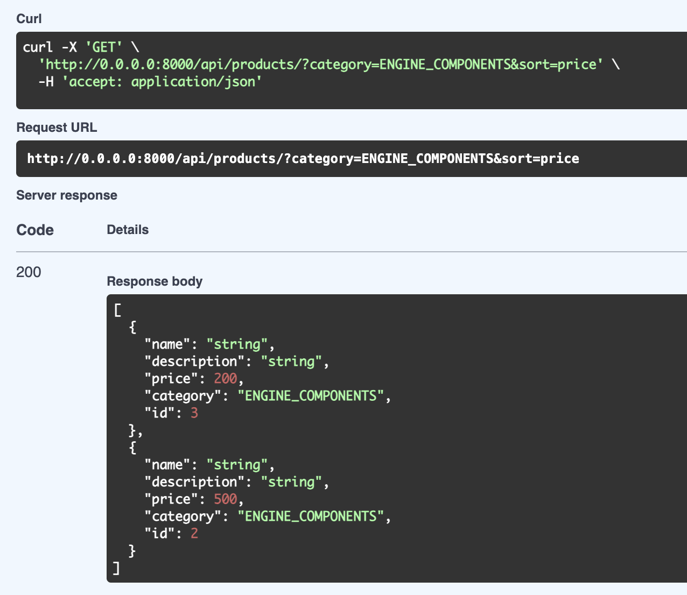

# Products CRUD


## Table of Contents
- [Used technologies](#-used-technologies)
- [Architecture](#-architecture)
- [Running](#-running)
- [API Documentation](#-api-documentation)

## Used technologies

`Python`, `FastAPI`, `PostgreSQL`, `Docker`

## Architecture

Clean Architecture is a software design philosophy that emphasizes 
the separation of concerns to make systems more flexible, 
maintainable, and testable. The core idea is to structure your 
system in layers, where the inner layers contain business rules and 
logic, while outer layers handle external concerns such as databases, 
UI, or frameworks. The system's core is independent of external 
technologies, making it easier to adapt and change parts of the 
system without affecting the whole.


```
src                                 → Application sources 
  └ application                     → Application services layer
       └ repositories               → Repository interfaces
       └ use_cases                  → Application business rules 
  └ controllers                     → Route handlers
  └ domain                          → Enterprise core business layer such as domain model objects (Entities, Value Objects)
       └ entities                   → Core business model objects
       └ services                   → Core business logic
  └ infrastructure                  → Frameworks, drivers and tools such as Database, the Web Framework, mailing/logging/glue code etc.
       └ authentication             → Logic related to authentication
       └ database                   → Database ORM models and Repository implementations
          └ sqlalchemy              → Database interface made with Sqlalchemy
              └ models              → ORM models
              └ repositories        → Implementation of domain repository interfaces
              └ selectors           → Standalone database queries
       └ webserver                  → Express.js Web server configuration (server, routes etc.)
          └ middleware              → Middlwares for authenticating, validating etc.
          └ routers                 → Server routes
          └ schemas                 → Schemas for validating incoming data

 └ requirements.txt                 → Dependencies
 └ main.py                          → Main application entry point
```

## Running

Run the following command to run the system locally:
```sh
docker stop products_local_db
docker rm products_local_db
docker run --name products_local_db -p 5432:5432 -e POSTGRES_PASSWORD=products -e POSTGRES_DB=products_db -e POSTGRES_USER=products_admin -d postgres:14
python main.py
```

## API Documentation

BASE URL: http://localhost:8000/api

API Documentation http://localhost:8000/api/docs/swagger.yml

<br>

Endpoints


<br>

Filters


<br>

Create


<br>

Update


<br>

Delete


<br>

List with filters


<br>

Detail


<br>

Not found

